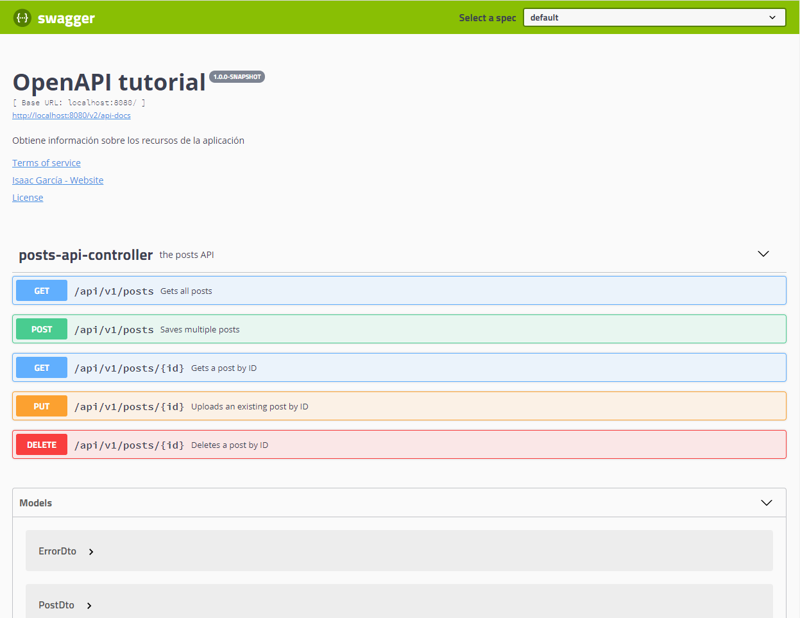
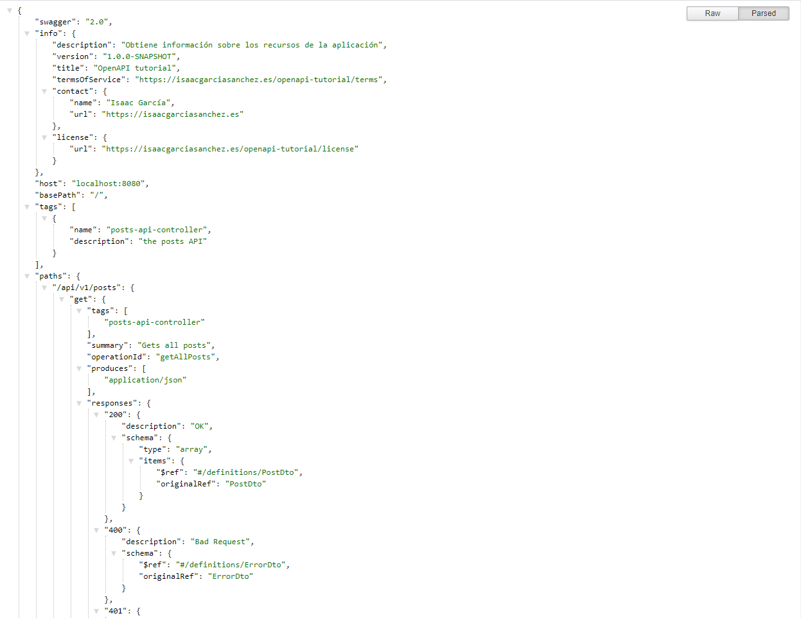
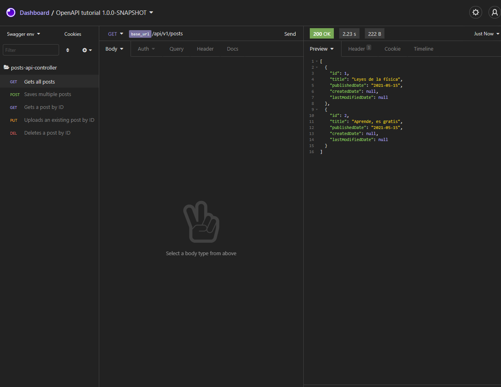

# OpenAPI tutorial

Proyecto con el que ilustar el uso de la [especificación OpenAPI](https://swagger.io/specification/) en Spring.

## Dependencias
### Generales
Las dependencias generales son aquellas que son necesarias para poder crear un entorno en el que ejecutar el tutorial.
- spring-boot-starter
- spring-boot-starter-web
- spring-boot-starter-data-jpa
- h2
- mapstruct
- mapstruct-processor
### Específicas
Las dependencias específicas son aquellas que son necesarias para poder crear un entorno en el que ejecutar el tutorial.
- springfox-swagger2
- springfox-swagger-ui
- validation-api
- javax.servlet-api
- swagger-models
- jackson-databind-nullable
## Plugins
### Generales
- maven-compiler-plugin
- spring-boot-maven-plugin
### Específicas
- openapi-generator-maven-plugin

### URL
- [SWAGGER UI](http://localhost:8080/swagger-ui.html)

- [API doc JSON](http://localhost:8080/v2/api-docs)

- Insomnia
  Copiando la URL de swagger-docs, es posible importar en el cliente REST Insomnia la especificación de la API.
